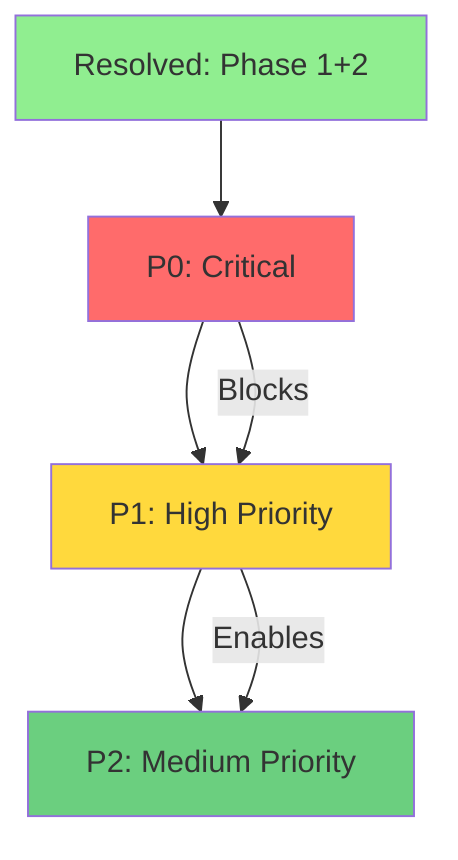

# Issues Index - StoryGenerator Pipeline

Complete breakdown of the C# video generation pipeline into manageable, priority-organized tasks following test-driven development best practices.

## 🎯 Priority-Based Organization

Issues are organized by **priority** and **status** rather than sequential phases, enabling:
- ✅ **Focus on critical path** - Work on what matters most
- ✅ **Better resource allocation** - Prioritize team efforts
- ✅ **Faster delivery** - Ship critical features first
- ✅ **TDD practices** - Test-first development workflow
- ✅ **Clear dependencies** - Know what blocks what

### ✅ Resolved Issues (6 tasks - Complete)
**Location:** [`resolved/`](resolved/README.md)

Completed and verified tasks:
- Phase 1: Interface setup (3 tasks)
- Phase 2: C# prototypes (3 tasks)

### 🔴 P0 - Critical Priority (8 tasks - Active)
**Location:** [`p0-critical/`](p0-critical/README.md)

**Must complete first.** Blockers for all other work:
- csharp-phase3-complete-generators (Complete remaining generators)
- content-pipeline (Reddit scraper + quality control)

**Estimated Effort:** 20-30 hours

### 🟡 P1 - High Priority (42 tasks - Next)
**Location:** [`p1-high/`](p1-high/README.md)

**Core pipeline implementation.** Start after P0:
- Pipeline orchestration
- Idea generation (7 tasks)
- Script development (5 tasks)
- Scene planning (3 tasks)
- Audio production (2 tasks)
- Subtitle creation (2 tasks)
- Image generation (4 tasks)
- Video production (3 tasks)
- Post-production (6 tasks)
- Quality control (3 tasks)
- Export & delivery (3 tasks)

**Estimated Effort:** 120-200 hours (many can run in parallel)

### 🟢 P2 - Medium Priority (9 tasks - Future)
**Location:** [`p2-medium/`](p2-medium/README.md)

**Publishing and analytics.** Begin after core pipeline works:
- Video generation advanced features
- Platform distribution (4 tasks)
- Analytics & optimization (4 tasks)

**Estimated Effort:** 60-80 hours

> **Note:** The Python-based sequential step issues (step-00 through step-14) have been archived to `obsolete/issues/` as they represent the obsolete Python implementation plan.

## 🎯 C# Implementation Issues

| Priority | Count | Estimated Effort | Location |
|----------|-------|------------------|----------|
| ✅ **Resolved** | 6 tasks | ~30 hours (done) | [resolved/](resolved/) |
| 🔴 **P0 Critical** | 8 tasks | 20-30 hours | [p0-critical/](p0-critical/) |
| 🟡 **P1 High** | 42 tasks | 120-200 hours | [p1-high/](p1-high/) |
| 🟢 **P2 Medium** | 9 tasks | 60-80 hours | [p2-medium/](p2-medium/) |
| **Master Roadmap** | Overview | N/A | [csharp-master-roadmap/](csharp-master-roadmap/) |

**Total:** 65 tasks | 200-310 hours remaining effort

## 📋 Detailed Breakdown by Priority

### P0 - Critical (Must Complete First)
1. **csharp-phase3-complete-generators** - Complete remaining C# generators
2. **content-pipeline/02-content-01-reddit-scraper** - Reddit content scraping (P0)
3. **content-pipeline/** - 5 additional content tasks (P1, but grouped with P0)

### P1 - High (Core Pipeline)
1. **csharp-phase4-pipeline-orchestration** - Full pipeline integration
2. **idea-generation/** - 7 tasks (story idea generation)
3. **script-development/** - 5 tasks (script creation & refinement)
4. **scene-planning/** - 3 tasks (visual storyboard)
5. **audio-production/** - 2 tasks (TTS & normalization)
6. **subtitle-creation/** - 2 tasks (timing & mapping)
7. **image-generation/** - 4 tasks (SDXL keyframes)
8. **video-production/** - 3 tasks (video synthesis)
9. **post-production/** - 6 tasks (editing & effects)
10. **quality-control/** - 3 tasks (validation)
11. **export-delivery/** - 3 tasks (final output)

### P2 - Medium (Publishing & Analytics)
1. **csharp-video-generators** - Advanced video features
2. **distribution/** - 4 tasks (YouTube, TikTok, Instagram, Facebook)
3. **analytics/** - 4 tasks (metrics, performance, optimization)

## 🔄 Development Workflow



### Priority Flow:
1. ✅ **Resolved** - Phases 1 & 2 complete
2. 🔴 **P0** - Complete generators + content foundation
3. 🟡 **P1** - Build complete generation pipeline  
4. 🟢 **P2** - Add distribution & analytics

## 📜 Obsolete Python Issues (Archived)

The Python-based sequential step issues (step-00 through step-14) have been moved to `obsolete/issues/` for historical reference. They represented the original Python implementation plan which is no longer maintained.

To view the archived Python issues:
```bash
cd obsolete/issues/
ls step-*
```

## 🚀 Getting Started

### For New Contributors:
1. **Read** [issues/README.md](README.md) for workflow overview
2. **Review** P0 critical issues in [p0-critical/](p0-critical/)
3. **Pick a task** and follow TDD practices
4. **Write tests first**, then implement
5. **Submit for review** when tests pass

### For Test-Driven Development:
- Write tests before code (Red-Green-Refactor)
- Target >80% test coverage
- Use dependency injection
- Follow SOLID principles
- Document as you code

## 🎬 Target Audience Segments

Each step applies to all combinations of:
- **Genders:** women, men
- **Age Buckets:** 10-13, 14-17, 18-23
- **Total Combinations:** 6 (2 × 3)

### Content Scale
- **Titles per segment:** 5 (top-scoring)
- **Total videos:** 30 (5 titles × 6 segments)
- **Shots per video:** 6-10 average
- **Total shots:** ~180-300 across all videos

## 📝 Step Details

### Step 0: Research Prototypes
**Duration:** 1-2 days  
**Deliverables:** Python & C# research stubs  
**Dependencies:** None  

Create proof-of-concept implementations for:
- LLM integration (Ollama, Qwen2.5, Llama3.1)
- ASR (faster-whisper)
- Image generation (SDXL)
- Video generation (LTX-Video)
- Audio normalization (FFmpeg)

**💡 RTX 5090 Optimization**: See [docs/MODELS.md#rtx-5090-optimization-guide](../docs/MODELS.md#rtx-5090-optimization-guide) for optimal local model configurations and performance targets.

[View Issue →](step-00-research/issue.md)

---

### Step 1: Ideas → Topics → Titles
**Duration:** 2-3 days  
**Deliverables:** Ideas, topics, titles per segment  
**Dependencies:** Step 0  

Generate 20+ ideas per segment, cluster into 8+ topics, create 10+ clickable titles.

[View Issue →](step-01-ideas/issue.md)

---

### Step 2: Viral Score (Titles)
**Duration:** 1-2 days  
**Deliverables:** Title scores, voice recommendations, top 5 selections  
**Dependencies:** Step 1  

Score all titles 0-100 using rubric, recommend voices, select top 5 per segment.

[View Issue →](step-02-viral-score/issue.md)

---

### Step 3: Raw Script → Iterate
**Duration:** 3-4 days  
**Deliverables:** Raw scripts (v0), iterated scripts (v1+), scores  
**Dependencies:** Step 2  

Generate scripts from selected titles, score them, iterate until improvement plateaus.

[View Issue →](step-03-raw-script/issue.md)

---

### Step 4: Improve Script (GPT/Local)
**Duration:** 2-3 days  
**Deliverables:** GPT-improved scripts (v2+), final scores  
**Dependencies:** Step 3  

Further improve scripts with focus on clarity, pacing, and hooks.

[View Issue →](step-04-improve-script/issue.md)

---

### Step 5: Improve Title (GPT/Local)
**Duration:** 1-2 days  
**Deliverables:** Title variants, scores, final selections  
**Dependencies:** Step 4  

Generate 5 variants per title, score them, select best performing.

[View Issue →](step-05-improve-title/issue.md)

---

### Step 6: Scene Planning
**Duration:** 2-3 days  
**Deliverables:** Shot definitions, beat-sheets, draft subtitles  
**Dependencies:** Steps 4, 5  

Create detailed scene breakdowns with shots, prompts, and subtitle drafts.

[View Issue →](step-06-scene-planning/issue.md)

---

### Step 7: Voiceover
**Duration:** 2-3 days  
**Deliverables:** TTS audio, normalized audio, metadata  
**Dependencies:** Steps 2, 4  

Generate voiceovers using local TTS, normalize to -14 LUFS.

[View Issue →](step-07-voiceover/issue.md)

---

### Step 8: Subtitle Timing
**Duration:** 1-2 days  
**Deliverables:** Timed SRT files, subtitle-to-shot mappings  
**Dependencies:** Steps 6, 7  

Use faster-whisper for forced alignment, create precise subtitle timing.

[View Issue →](step-08-subtitle-timing/issue.md)

---

### Step 9: Key Images (SDXL)
**Duration:** 3-5 days  
**Deliverables:** Keyframe images (v1, v2), prompts, selections  
**Dependencies:** Step 6  

Generate keyframes using SDXL for each shot, with optional refinement passes.

[View Issue →](step-09-key-images/issue.md)

---

### Step 10: Video Generation
**Duration:** 4-6 days  
**Deliverables:** Video clips (LTX or interpolation), metadata  
**Dependencies:** Steps 6, 9  

Generate video clips using LTX-Video or interpolation, compare methods.

[View Issue →](step-10-video-generation/issue.md)

---

### Step 11: Post-Production
**Duration:** 2-4 days  
**Deliverables:** Draft videos with audio, subtitles, effects  
**Dependencies:** Steps 7, 8, 10  

Assemble all elements: video clips, audio, subtitles, transitions.

[View Issue →](step-11-post-production/issue.md)

---

### Step 12: Quality Checks
**Duration:** 2-3 days  
**Deliverables:** QC reports, issue lists, approval status  
**Dependencies:** Step 11  

Test on devices, verify specs, check quality, generate QC reports.

[View Issue →](step-12-quality-checks/issue.md)

---

### Step 13: Final Export
**Duration:** 1-2 days  
**Deliverables:** Final videos, thumbnails, metadata, platform prep  
**Dependencies:** Step 12  

Export production-ready files with metadata and platform-specific optimization.

[View Issue →](step-13-final-export/issue.md)

---

## 🔧 Configuration Files

All steps reference these configuration files:
- `/config/pipeline.yaml` - Model and pipeline settings
- `/config/scoring.yaml` - Viral scoring rubric
- `/config/schemas/` - JSON schemas for data formats

## 📁 Output Directories

Organized under `/src/Generator/`:
```
Generator/
├── ideas/{gender}/{age}/
├── topics/{gender}/{age}/
├── titles/{gender}/{age}/
├── scores/{gender}/{age}/
├── scripts/raw_local/{gender}/{age}/
├── scripts/iter_local/{gender}/{age}/
├── scripts/gpt_improved/{gender}/{age}/
├── voices/choice/{gender}/{age}/
├── audio/tts/{gender}/{age}/
├── audio/normalized/{gender}/{age}/
├── subtitles/srt/{gender}/{age}/
├── subtitles/timed/{gender}/{age}/
├── scenes/json/{gender}/{age}/
├── images/keyframes_v1/{gender}/{age}/
├── images/keyframes_v2/{gender}/{age}/
├── videos/ltx/{gender}/{age}/
├── videos/interp/{gender}/{age}/
└── final/{gender}/{age}/
```

## ⚡ Quick Start

1. **Start with Step 0:** Set up research prototypes
2. **Follow sequence:** Each step builds on previous steps
3. **Use validation:** Run `@copilot check` after completing each step
4. **Track progress:** Use MicrostepValidator for progress tracking

## 📊 Progress Tracking

Use the MicrostepValidator system:
```python
from Tools.MicrostepValidator import MicrostepValidator

validator = MicrostepValidator()
validator.list_microsteps()

# After completing work
validator.validate_step(step_number, gender, age)
```

## 🎯 Total Timeline

**Estimated Duration:** 30-45 days for complete pipeline (all 30 videos)

**Breakdown:**
- Setup & Research: 1-2 days
- Content Generation (Steps 1-5): 10-14 days
- Production (Steps 6-11): 16-23 days
- QC & Export (Steps 12-13): 3-5 days

## 📚 Documentation

- `/docs/MICROSTEP_VALIDATION.md` - Validation system guide
- `/docs/GENERATOR_STRUCTURE.md` - Folder structure details
- `/docs/PIPELINE.md` - Complete pipeline documentation

## 🤝 Contributing

When working on an issue:
1. Read the issue file thoroughly
2. Follow the checklist
3. Create required artifacts
4. Use MicrostepValidator for tracking
5. Comment `@copilot check` when complete

---

**Last Updated:** 2024-01-01  
**Version:** 1.0  
**Total Issues:** 14
